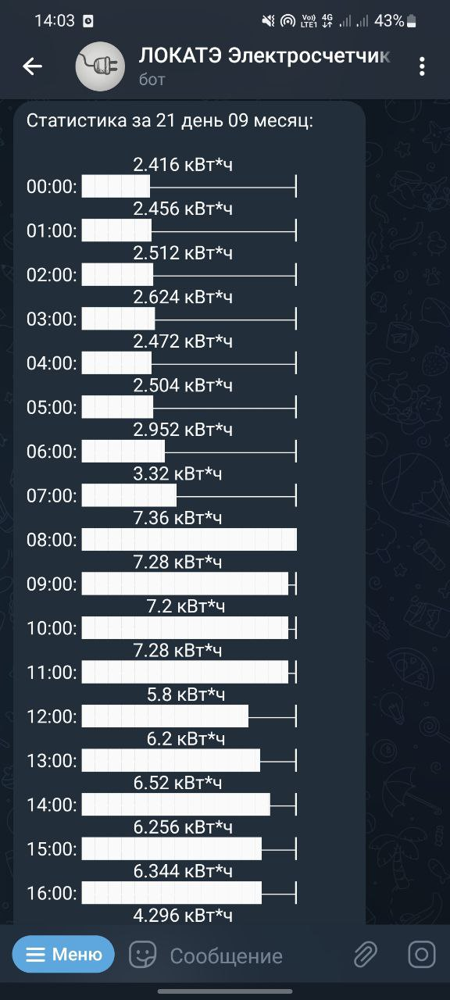
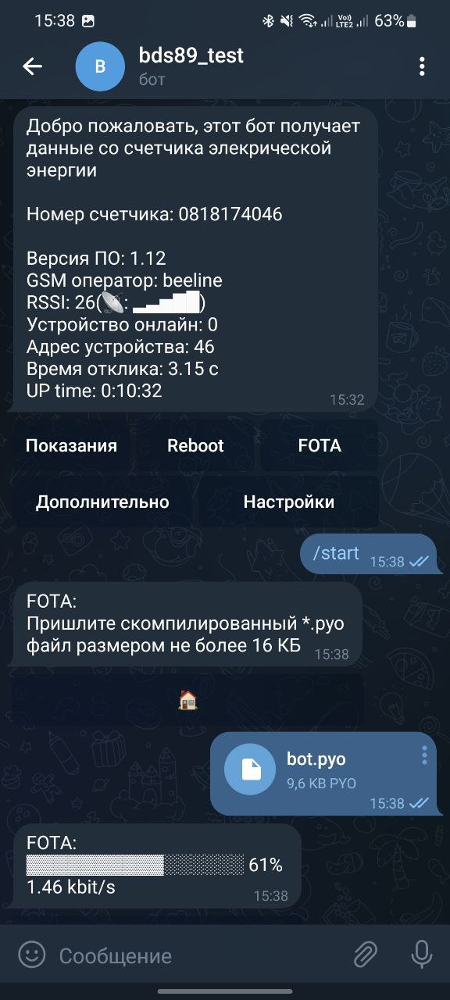

# TG21 СЭТ-4ТМ Telegram bot

Телеграм бот, который считывает данные со счетчиков электрической энергии типа СЭТ-4ТМ, с помощью GSM модема IRZ TG21.

  

## Описание
Считывает:
- показания электроэнергии
- мгновенная мощность
- напряжение
- ток
- частота

📈Собирает статистику за:
- год (по месяцам)
- месяц (по дням)
- день (по часам)

❌ При отсутствии соединения с сервером, можно отправить боту смс, с командой: `Energy`- для передачи показаний в ответном сообщении или командой `Reboot` - для перезагрузки модема.

Возможна удаленная загрузка новой прошивки в модем по воздуху, с созданием автоматического бэкапа и отката до него, в случае возникновения исключения Python в главном икле.

## Установка

Бот состоит из скриптов для серверной части и скриптов для модема. 
Модем подключается к серверной части, по указанным в начале скрипта `bot.py` литералам (IP адресс и порт).
Серверная часть работает на Python 3.10 и выше. Скрипты для модема, перед загрузкой на устройство необходимо компилировать в `bot.pyo`. 

1. Серверная часть.
    > Скопировать содержимое папки `server`
    
    > Внесите данные в `config.yaml`

    > Открыть выбранный порт в настройках роутера

    > Запустить скрипт `tg21.py` с помощью Python 3.10

2. Скрипт для модема.
    > Скопировать содержимое папки `modem`
    
    > Внести изменения в литералы, в начале скрипта `bot.py`

    > С помощью [компилятора](http://www.radiofid.ru/upload/files/software/SDK_Telit_for_Python_1-5-2.zip) проверить а затем скомпилировать файл `bot.py` в `bot.pyo` (правая кнопка на файле - compile)

    > C помощью [загрузчика скриптов](http://www.radiofid.ru/getfile.php?file=upload/files/software/ScriptLoader.exe) загрузить скрипты `bot.pyo`, `crc16.pyo`, `init.pyo`, `sms.pyo`

    > Перезагрузить модем

3. Начать чать в телеграм со своим ботом с помощью команды `/start`

**Поддерживаемые ОС**

- Linux
- Windows